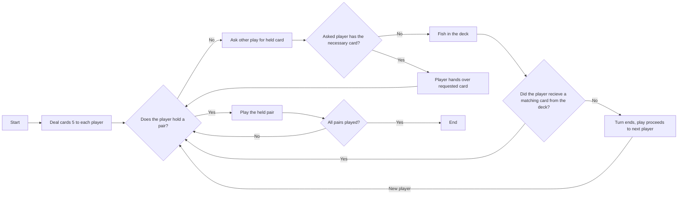

```mermaid
 
flowchart LR
    %% Define all nodes
    Start
    Deal[Deal cards 5 to each player]

    CanPlay{Does the player hold a pair?}
    PlayPair[Play the held pair]
    AskOther[Ask other play for held card]
    PlayerHasCard{Asked player has the necessary card?}
    GoFish[Fish in the deck]
    GetCard[Player hands over requested card]
    SuccessfulFish{Did the player recieve a matching card from the deck?}

    TurnEnd[Turn ends, play proceeds to next player]

    AllPlayed{All pairs played?}
    End
    
    %% Connect all nodes
    Start --> Deal
    Deal --> CanPlay
    CanPlay-->|Yes|PlayPair
    CanPlay-->|No|AskOther

    PlayPair-->AllPlayed

    AskOther-->PlayerHasCard
    PlayerHasCard-->|Yes|GetCard
    PlayerHasCard-->|No|GoFish

    GetCard-->CanPlay
    GoFish-->SuccessfulFish
    SuccessfulFish-->|No|TurnEnd
    SuccessfulFish-->|Yes|CanPlay

    TurnEnd-->|New player|CanPlay

    AllPlayed-->|Yes|End
    AllPlayed-->|No|CanPlay
```