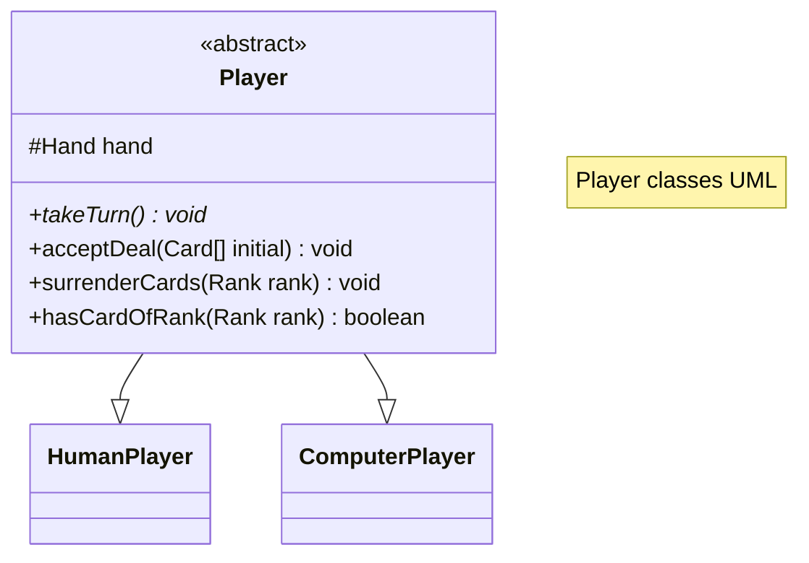

---
Player class diagram
---

```mermaid
classDiagram
    note "Player classes UML"

    Player --|> HumanPlayer
    Player --|> ComputerPlayer

    class Player {
        <<abstract>>
        #Hand hand
        +takeTurn()* void
        +acceptDeal(Card[] initial) void
        +surrenderCards(Rank rank) void
        +hasCardOfRank(Rank rank) boolean
    }

    class HumanPlayer {
        
    }

    class ComputerPlayer {
        
    }

```