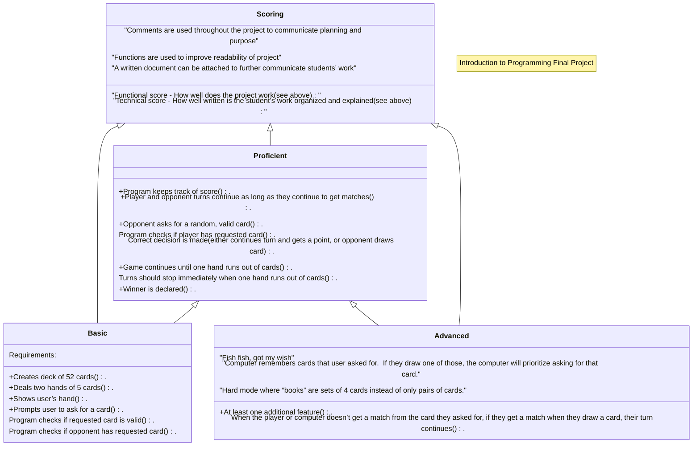

```mermaid
classDiagram
    note "Introduction to Programming Final Project"

    Scoring <|-- Basic
    Proficient <|-- Basic
    Scoring <|-- Proficient
    Proficient <|-- Advanced
    Scoring <|-- Advanced
    Scoring : "Functional score - How well does the project work (see above)"
    Scoring : "Technical score - How well written is the student’s work organized and explained (see above)"
    Scoring : "Comments are used throughout the project to communicate planning and purpose"
    Scoring : "Functions are used to improve readability of project"
    Scoring : "A written document can be attached to further communicate students’ work"

    class Basic {
        Requirements:
        +Creates deck of 52 cards().
        +Deals two hands of 5 cards().
        +Shows user’s hand().
        +Prompts user to ask for a card().
        Program checks if requested card is valid().
        Program checks if opponent has requested card().
    }
    class Proficient {
        +Program keeps track of score().
        +Player and opponent turns continue as long as they continue to get matches().
        +Opponent asks for a random, valid card().
        Program checks if player has requested card().
        Correct decision is made (either continues turn and gets a point, or opponent draws card).
        +Game continues until one hand runs out of cards().
        Turns should stop immediately when one hand runs out of cards().
        +Winner is declared().
    }
    class Advanced {
        +At least one additional feature().
        "Fish fish, got my wish"
        When the player or computer doesn’t get a match from the card they asked for, if they get a match when they draw a card, their turn continues().
        "Computer remembers cards that user asked for.  If they draw one of those, the computer will prioritize asking for that card."
        "Hard mode where “books” are sets of 4 cards instead of only pairs of cards."
    }

```
