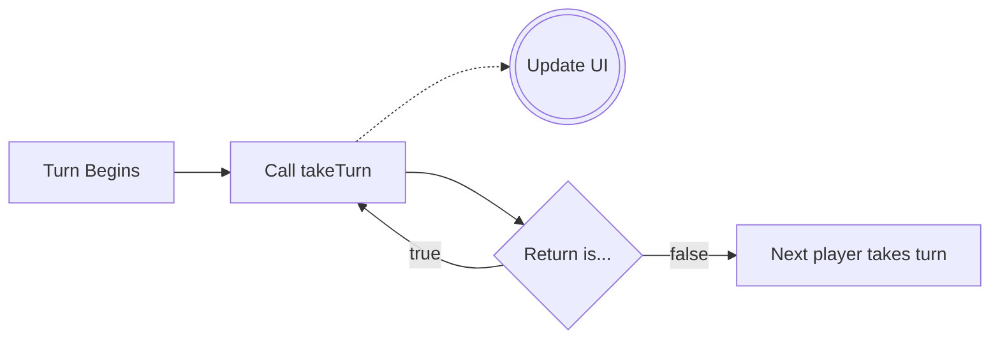

```mermaid
flowchart LR
    %% define nodes
    Start[Turn Begins]
    End[Next player takes turn]

    takeTurn[Call takeTurn]
    doAnimation(((Update UI)))
    rtn{Return is...}

    Start --> takeTurn
    takeTurn -->rtn
    rtn -->|true|takeTurn
    rtn-->|false|End
    takeTurn -.-> doAnimation    
```